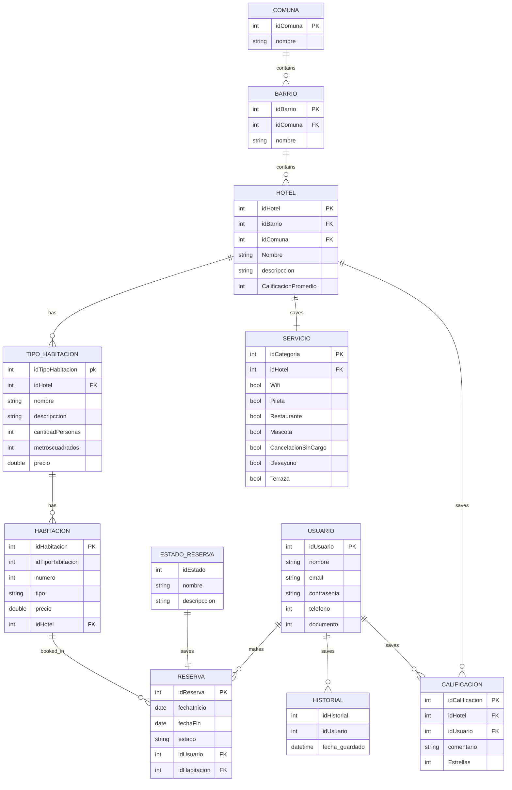

# Crossroads
 App para planificar viajes

# Diagrama de Base de Datos

```mermaid
erDiagram

    COMUNA{
        int idComuna PK
        string nombre
    }
    BARRIO{
        int idBarrio PK
        int idComuna FK
        string nombre
    }
    HOTEL{
        int idHotel PK
        int idBarrio FK
        int idComuna FK
        string Nombre
        string descripccion
        int CalificacionPromedio
    }
    TIPO_HABITACION{
        int idTipoHabitacion pk
        int idHotel FK
        string nombre
        string descripccion
        int cantidadPersonas
        int metroscuadrados
        double precio
    }
    SERVICIO{
        int idCategoria  PK
        int idHotel FK
        bool Wifi
        bool Pileta
        bool Restaurante
        bool Mascota
        bool CancelacionSinCargo
        bool Desayuno
        bool Terraza
    }
    CALIFICACION{
        int idCalificacion PK
        int idHotel FK
        int idUsuario FK
        string comentario
        int Estrellas
    }
    HABITACION {
        int idHabitacion PK
        int idTipoHabitacion
        int numero
        string tipo
        double precio
        int idHotel FK
    }
    RESERVA{
        int idReserva PK
        date fechaInicio
        date fechaFin
        string estado
        int idUsuario FK
        int idHabitacion FK
    }
    ESTADO_RESERVA{
        int idEstado
        string nombre
        string descripccion
    }
    USUARIO{
        int idUsuario PK
        string nombre
        string email
        string contrasenia
        int telefono
        int documento
    }

    HISTORIAL{
        int idHistorial 
        int idUsuario 
        datetime fecha_guardado
    }
    BARRIO ||--o{ HOTEL : contains
    COMUNA ||--o{ BARRIO : contains
    HOTEL||--o{TIPO_HABITACION:has
    TIPO_HABITACION||--o{HABITACION:has
    USUARIO ||--o{ RESERVA : makes
    USUARIO ||--o{ HISTORIAL: saves
    USUARIO ||--o{CALIFICACION: saves
    HABITACION ||--o{ RESERVA : booked_in
    HOTEL ||--||SERVICIO: saves
    HOTEL ||--o{CALIFICACION: saves
    ESTADO_RESERVA||--||RESERVA:saves
```

# Diagrama de Clases